# 基于vue的客户关系管理系统

---
### 👉作者QQ ：1556708905 微信：zheng0123Long (支持定制修改、部署调试、定制毕设)

### 👉接网站建设、小程序、H5、APP、各种系统等

---

#### 介绍

在当今竞争激烈的商业环境中，有效地管理客户关系对于企业的成功至关重要。客户关系管理系统（CRM）作为一种重要的工具，能够帮助企业更好地了解客户需求、提高客户满意度、增强客户忠诚度，从而提升企业的竞争力。然而，传统的 CRM 系统往往存在操作复杂、界面不友好、功能不够灵活等问题。
本基于 Vue 的客户关系管理系统旨在提供一个简洁、高效、易用的解决方案，帮助企业优化客户管理流程，提高销售效率和客户服务质量。

#### 技术栈

后端技术栈：Springboot+Mysql+Maven

前端技术栈：Vue+Html+Css+Javascript+ElementUI

开发工具：Idea+Vscode+Navicate

#### 系统功能介绍

（一）管理员角色  
个人中心：管理员可以在个人中心查看和修改个人信息，设置系统偏好，查看系统通知和操作日志。  
基础数据管理：  
负责维护系统的基础数据，如产品信息、服务类别、业务区域等。  
对数据进行添加、修改、删除和查询操作，确保数据的准确性和完整性。  
沟通记录管理：  
查看和监督员工与客户的沟通记录，包括电话沟通、邮件往来、即时通讯等。  
分析沟通的效果和质量，为改进沟通策略提供依据。  
客户管理：  
全面管理客户信息，包括客户基本资料、购买历史、消费偏好等。  
对客户进行分类和分组，以便制定针对性的营销和服务策略。  
处理客户的投诉和建议，跟踪问题解决的进度。  
客户积分管理：  
设定客户积分规则，如消费积分、活动积分等。  
管理客户积分的增减操作，审核积分兑换申请。  
客户线索管理：  
收集和整理潜在客户的线索信息，如来源渠道、意向产品等。  
分配线索给员工进行跟进，跟踪线索的转化情况。  
员工管理：  
管理员工的基本信息，包括入职时间、岗位信息、联系方式等。  
为员工分配权限和工作任务，评估员工的工作绩效。  

（二）员工角色  
个人中心：员工在个人中心可以更新个人资料，查看工作任务和绩效评估结果。  
沟通记录管理：  
记录与客户的沟通详情，包括沟通时间、方式、内容和结果。  
对沟通情况进行总结和分析，以便更好地了解客户需求。  
客户管理：  
维护自己负责的客户信息，及时更新客户动态。  
为客户提供个性化的服务，提高客户满意度。  
客户积分管理：  
根据客户的消费行为和参与活动情况，为客户增加或扣除积分。  
协助客户进行积分兑换操作。  
客户线索管理：  
接收管理员分配的客户线索，进行跟进和转化。  
反馈线索跟进的情况，为线索的重新分配或调整提供依据。  

#### 系统作用

提升客户满意度  
通过精细化的客户管理和个性化的服务，满足客户需求，提高客户对企业的满意度和忠诚度。  

提高销售效率  
有效地管理客户线索和销售机会，合理分配资源，提高销售团队的工作效率和业绩。

优化决策支持  
提供丰富的数据分析和报表功能，帮助管理层做出科学的决策。

加强团队协作  
促进管理员与员工之间、员工与员工之间的信息共享和协作，提升整体工作效率。

#### 系统功能截图

代码结构

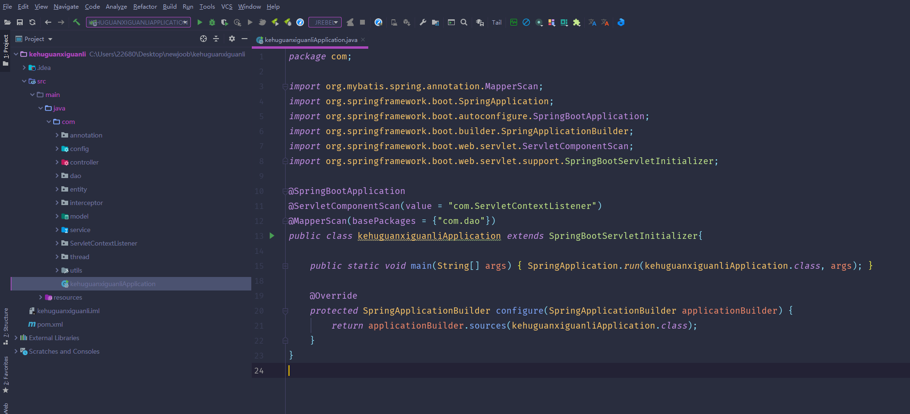

数据库表

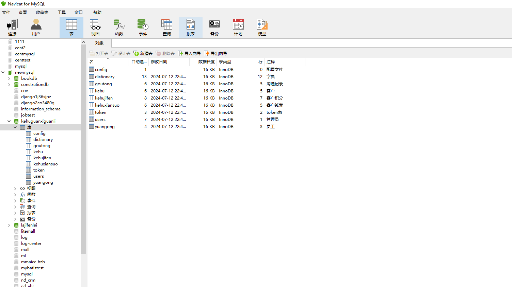

登录

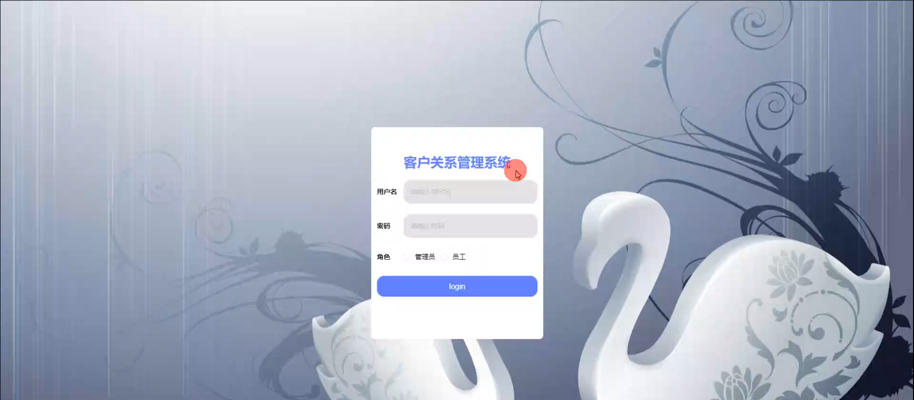

基础数据管理

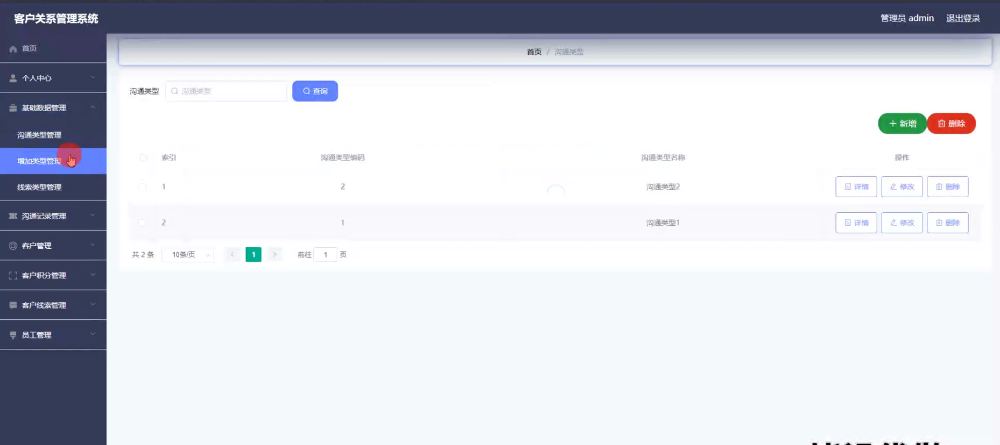

沟通记录管理

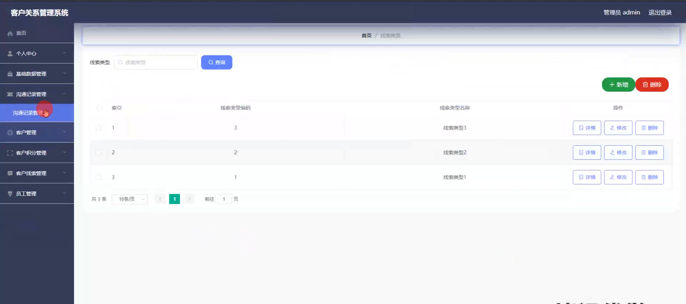

客户积分管理

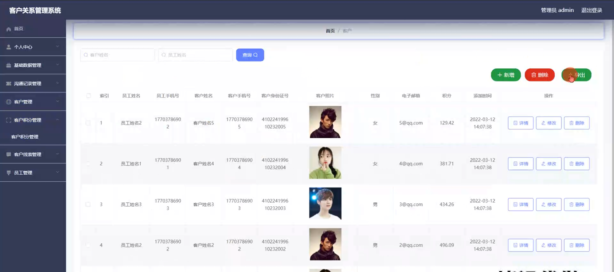

客服线索管理

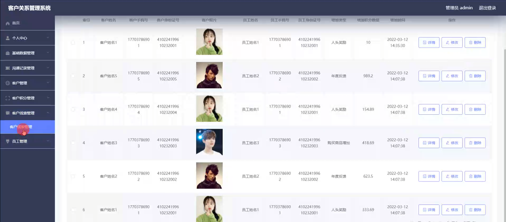

员工管理

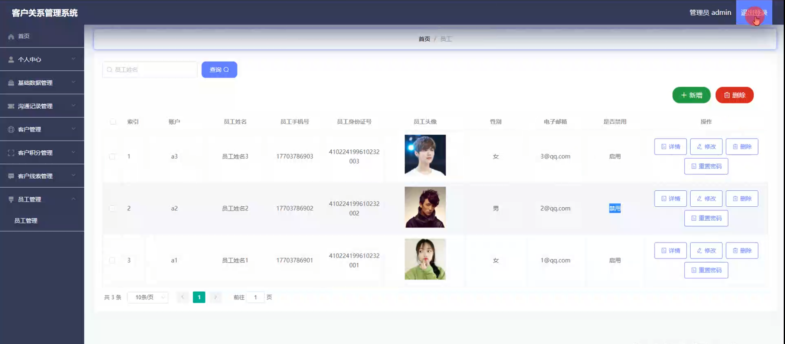

员工端个人信息

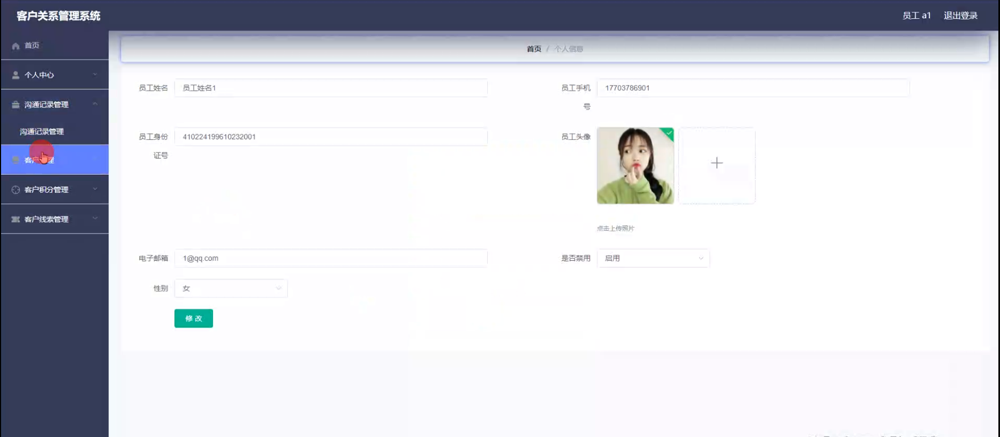

员工端沟通记录管理

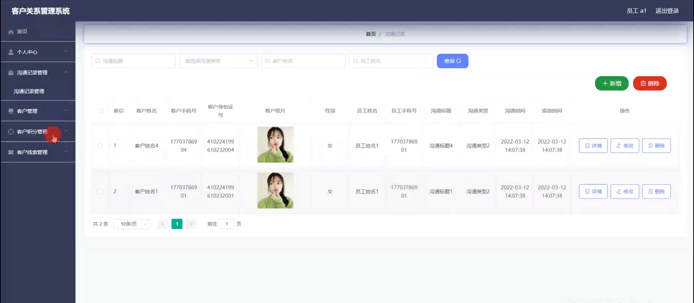

客户管理

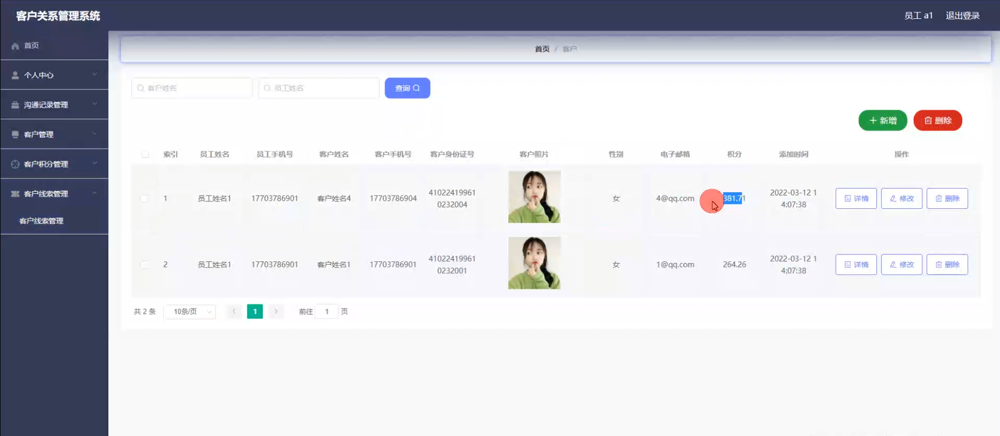

客户积分管理

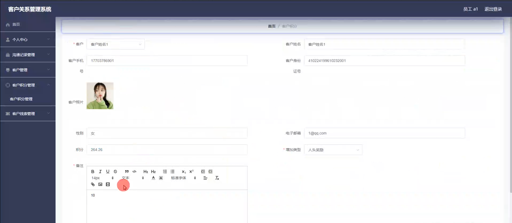

#### 总结

基于 Vue 的客户关系管理系统为企业提供了强大的客户管理功能。然而，该系统仍存在一些潜在的局限性，如对于复杂业务流程的支持可能不够完善，与其他外部系统的集成能力有待增强，在大数据量处理时的性能可能需要进一步优化等。未来，我们将不断改进和完善系统，提升系统的稳定性和扩展性，加强与其他业务系统的融合，为企业提供更优质的客户关系管理服务，助力企业实现可持续发展。

#### 使用说明

创建数据库，执行数据库脚本 修改jdbc数据库连接参数 下载安装maven依赖jar 启动idea中的springboot项目

后台登录页面
http://localhost:8080/kehuguanxiguanli/admin/dist/index.html

管理员				账户:admin 		密码：admin

员工				账户:a1 		密码：123456